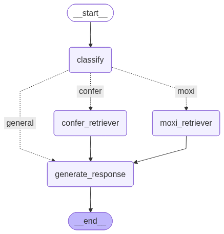

#  Multi-Source RAG Orchestrator

Visit: http://xc0cssg0ook40ckwgk4kocko.144.126.158.171.sslip.io/


## 📋 Overview

The **Intelligent Multi-Source RAG Orchestrator** is a sophisticated AI system that intelligently routes user queries to specific knowledge bases using semantic understanding. Built with LangGraph, it implements a Router-Retriever-Generator architecture that eliminates hallucinations and ensures precise, context-aware responses.

### 🎯 Key Features

- **🧠 Intelligent Query Routing**: Automatically classifies queries into MoXi (Mortgage/Loans), Confer (Platform Features), or General conversation
- **📚 Multi-Source RAG**: Retrieves from distinct Qdrant vector databases based on query intent
- **🔒 Safety-First Design**: Built-in content filtering and harmful query detection
- **⚡ Stateful Orchestration**: LangGraph-powered workflow with conditional execution paths
- **🎨 Modern UI**: Beautiful Next.js frontend with real-time chat interface
- **🐳 Production Ready**: Dockerized services optimized for Coolify deployment

---

## 🏗️ Architecture

The system operates as a Directed Acyclic Graph (DAG) with the following workflow:

```
User Query → Classification → Conditional Routing → Retrieval → Response Generation
                    ↓              ↓         ↓
                 [moxi]        [confer]  [general]
                    ↓              ↓         ↓
              MoXi DB        Confer DB    (Skip)
                    ↓              ↓         ↓
                    └──────────────┴─────────→ LLM Response
```

### Components

1. **Classification Node**: Semantic intent analysis with deterministic fallbacks
2. **Retrieval Nodes**: Parallel vector search across specialized knowledge bases
3. **Generation Node**: Context-aware response synthesis with safety guardrails

## 🚀 Quick Start

### Prerequisites

- Python 3.11+
- Node.js 20+
- Docker & Docker Compose (for deployment)
- OpenAI API Key
- Qdrant Vector Database

### Local Development

#### Backend Setup

```bash
cd Backend

# Create virtual environment
python -m venv .venv
source .venv/bin/activate  # On Windows: .venv\Scripts\activate

# Install dependencies
pip install -r requirements.txt

# Configure environment
cp .env.example .env
# Edit .env with your API keys

# Run the server
uvicorn server:app --reload --port 8000
```

#### Frontend Setup

```bash
cd Frontend

# Install dependencies
npm install

# Configure environment
cp env.sample .env.local
# Edit .env.local with your backend URL

# Run development server
npm run dev
```

Visit `http://localhost:3000` to access the application.

---

## 🛠️ Technology Stack

### Backend
- **Framework**: FastAPI 0.109
- **Orchestration**: LangGraph 0.0.20
- **LLM Integration**: LangChain + OpenAI
- **Vector Database**: Qdrant 1.7.0
- **Validation**: Pydantic 2.5.3

### Frontend
- **Framework**: Next.js 16.0+
- **UI Library**: Radix UI + Tailwind CSS
- **State Management**: React Hooks
- **HTTP Client**: Axios
- **Styling**: Tailwind CSS 4.1+

---

## 🔧 Configuration

### Backend Environment Variables

```env
# LLM Configuration
OPENAI_API_KEY=sk-...

# Vector Database
QDRANT_URL=https://qdrant.confersolutions.ai
QDRANT_API_KEY=...

### Frontend Environment Variables

```env
# API Configuration
NEXT_PUBLIC_API_URL=http://localhost:8000

# Environment
NODE_ENV=development
```

---

## 📊 System Workflow

### 1. Query Classification

The system first analyzes the user's intent:

```python
class RouteQuery(BaseModel):
    datasource: Literal["confer", "moxi", "general"]
```

**Deterministic Rules:**
- Contains "moxi" → Route to MoXi database
- Contains "confer" → Route to Confer database
- Otherwise → LLM-based semantic classification

### 2. Retrieval (Conditional)

If classified as `moxi` or `confer`:
- Perform similarity search in respective Qdrant collection
- Retrieve top 4 most relevant documents
- Extract page content for context injection

### 3. Response Generation

**RAG Mode** (with retrieved documents):
- Temperature: 0.0 (factual accuracy)
- Context: Injected retrieved documents
- Principles: Accuracy, Clarity, Helpfulness

**General Mode** (no retrieval):
- Temperature: 0.5 (conversational)
- Personality: Warm, professional assistant
- Guidance: Ask for clarification on product queries

---

## 📁 Project Structure

```
.
├── Backend/
│   ├── app.py              # LangGraph orchestration logic
│   ├── server.py           # FastAPI server
│   ├── prompts.json        # Externalized prompts
│   ├── requirements.txt    # Python dependencies
│   ├── Dockerfile          # Backend container
│   └── .env.example        # Environment template
│
├── Frontend/
│   ├── app/                # Next.js app directory
│   ├── components/         # React components
│   │   ├── ChatWindow.tsx
│   │   ├── InputBox.tsx
│   │   ├── MessageBubble.tsx
│   │   └── Sidebar.tsx
│   ├── hooks/              # Custom React hooks
│   ├── lib/                # Utility functions
│   ├── public/             # Static assets
│   ├── Dockerfile          # Frontend container
│   └── package.json        # Node dependencies
│
├── graph.png               # Architecture diagram
├── PRD.md                  # Product requirements
├── COOLIFY_DEPLOYMENT.md   # Deployment guide
└── README.md               # This file
```


